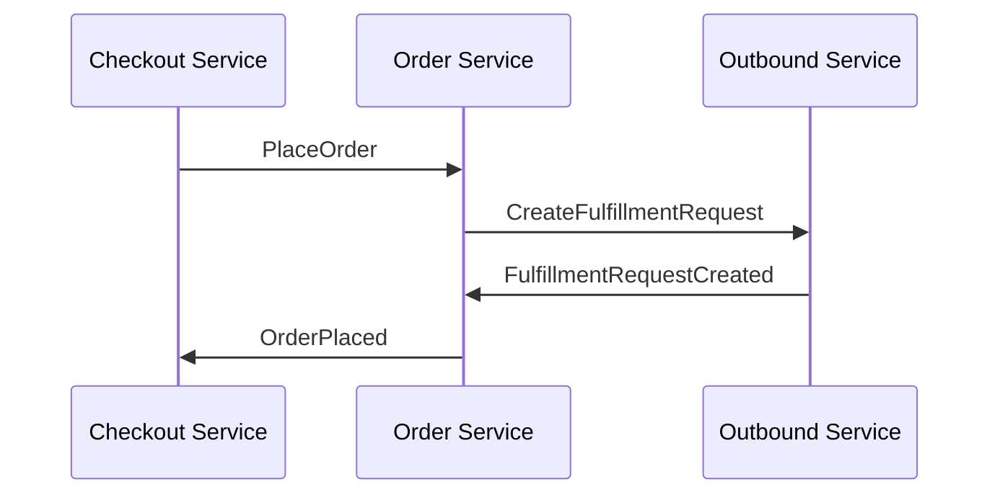

<NodeGraph/>

## Main Focus

One of the principle focus of the Orders subdomain is to manage the lifecycle of customer orders. Placing an order is the first step in this process, which involves several key steps and events to ensure the order is processed correctly.

